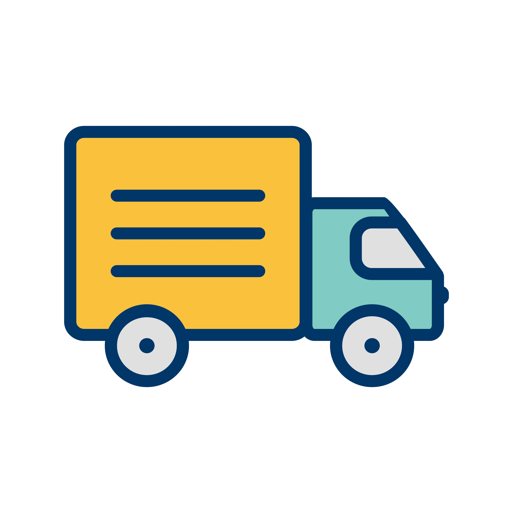

<a name="readme-top"></a>


<!-- PROJECT SHIELDS -->
<!--
*** I'm using markdown "reference style" links for readability.
*** Reference links are enclosed in brackets [ ] instead of parentheses ( ).
*** See the bottom of this document for the declaration of the reference variables
*** for contributors-url, forks-url, etc. This is an optional, concise syntax you may use.
*** https://www.markdownguide.org/basic-syntax/#reference-style-links
-->
[![LinkedIn][linkedin-shield]][linkedin-url]


<!-- PROJECT LOGO -->
<br />
<div align="center">
  <a href="https://github.com/awcereh/route-optimization-engine">
    
  </a>

  <h3 align="center">Route Optimization Engine</h3>

  <p align="center">
    An Intern final project at PT Xquisite Analitika Indonesia.
    <br />
    <a href="https://github.com/awcereh/Ozon-Detection">View Demo</a>
    ·
    <a href="https://www.datascienceportfol.io/rosyids_">Report Bug</a>
  </p>
</div>


<!-- TABLE OF CONTENTS -->
<details>
  <summary>Table of Contents</summary>
  <ol>
    <li>
      <a href="#about-the-project">About The Project</a>
      <ul>
        <li><a href="#built-with">Built With</a></li>
      </ul>
    </li>
    <li>
      <a href="#getting-started">Getting Started</a>
      <ul>
        <li><a href="#installation">Installation</a></li>
      </ul>
    </li>
    <li><a href="#usage">Usage</a></li>
    <li><a href="#roadmap">Roadmap</a></li>
    <li><a href="#contributing">Contributing</a></li>
    <li><a href="#contact">Contact</a></li>
  </ol>
</details>


<!-- ABOUT THE PROJECT -->
## About The Project

[![Product Name Screen Shot][product-screenshot]]

This repository solves the Vehicle Routing Problem using OpenStreetMap and the Google OR-Tools library. The VRP is a classic optimization problem where a fleet of vehicles is tasked with visiting several locations to minimize the total distance and time traveled. The data used includes data from Alfamart and Indomaret stores across South Jakarta, which I grouped to contain only 2 coordinates per subdistrict.

The VRP is a classic optimization problem where a number of vehicles are tasked with visiting several locations to minimize travel costs.
Analyzing the Ozone Level detection dataset using Fast Fourier Transform, performing visualization and data reduction (PCA), and creating prediction models

This dataset contains:
   1. **nama_tempat:** contains the name of the place, either Alfamart or Indomaret
   2. **rating_tempat:** the rating of the place based on Google Maps
   3. **user_ratings_total:** the total number of users who rated the place
   4. **latitude & longitude:** the coordinates of the Alfamart or Indomaret location
   5. **alamat_tempat:** the address of the place
   6. **place_ID:** the ID of each store
   7. **store:** distinguishes whether the place is an Alfamart or Indomaret
   8. **nama_kelurahan:** the name of the subdistrict where the store is located
   9. **nama_kecamatan:** the name of the district where the store is located
   10. **nama_kota** the name of the city where the store is located

<p align="right">(<a href="#readme-top">back to top</a>)</p>


### Built With


This project was completed using Excel and Python: with the libraries OpenStreetMap, Google OR-Tools, geopy, pandas, as well as Matplotlib and Folium for data visualization.

* [![Python][Python.org]][Python-url]
* [![Excel][Excel.com]][Excel-url]

<p align="right">(<a href="#readme-top">back to top</a>)</p>

<!-- GETTING STARTED -->
## Getting Started

### Installation

_If you want to run the code for learning purposes or to change the parameters, please follow the steps below:_

1. Download Zip, or
2. Clone the repo
   ```sh
   git clone https://github.com/awcereh/route-optimization-engine.git
   ```
3. Run in your code editor (Recommended: VS Code).

<p align="right">(<a href="#readme-top">back to top</a>)</p>


<!-- USAGE EXAMPLES -->
## Usage

### Vehicle Routing Problem (VRP)
[![VRP][VRP-url]
[![VRP1][VRP1-url] <br />
The Vehicle Routing Problem (VRP) is a type of transportation problem that involves distributing goods or people to customers using vehicles, with the goal of minimizing several distribution objectives.

Based on the results, it can be seen that all vehicles successfully completed their routes.

### Capacitated Vehicle Routing Problem (CVRP)
[![CVRP][CVRP-url]
[![CVRP1][CVRP1-url] <br />
The CVRP algorithm is the same as the VRP, except that during the chromosome selection process, vehicle capacity constraints are added. If a vehicle reaches its specified capacity, it will stop visiting points that could increase the load. Therefore, due to limitations in the data, I used dummy data to fill in the vehicle capacity gaps in the model. Based on the results, it can be seen that all vehicles successfully completed their routes and vehicle capacities.

### Capacitated Vehicle Routing Problem with Time Windows (CVRPTW) -- on process
[![CVRPTW][CVRPTW-url]


<p align="right">(<a href="#readme-top">back to top</a>)</p>


<!-- ROADMAP -->
## Roadmap

- [x] VRP
- [x] CVRP
- [] CVRPTW

<p align="right">(<a href="#readme-top">back to top</a>)</p>


<!-- CONTRIBUTING -->
## Contributing

If you have a suggestion that would make this better, please fork the repo and create a pull request. You can also simply open an issue with the tag "enhancement".
Don't forget to give the project a star! Thanks again!

1. Fork the Project
2. Create your Feature Branch
3. Commit your Changes
4. Push to the Branch
5. Open a Pull Request

<p align="right">(<a href="#readme-top">back to top</a>)</p>


<!-- CONTACT -->
## Contact

Muhammad Rosyid Suseno - [@rosyids_](https://instagram.com/rosyids_) - muhammadrosyid1229@gmail.com

Project Link: [https://github.com/awcereh/Ozon-Detection](https://github.com/awcereh/route-optimization-engine)

<p align="right">(<a href="#readme-top">back to top</a>)</p>


<p align="right">(<a href="#readme-top">back to top</a>)</p>


<!-- MARKDOWN LINKS & IMAGES -->
<!-- https://www.markdownguide.org/basic-syntax/#reference-style-links -->
[linkedin-shield]: https://img.shields.io/badge/-LinkedIn-black.svg?style=for-the-badge&logo=linkedin&colorB=555
[linkedin-url]: https://www.linkedin.com/in/mrosyids/
[product-screenshot]: images/The-Capacitated-Vehicle-Routing-Problem-CVRP.png
[Python.org]: https://img.shields.io/badge/Python-3776AB?style=for-the-badge&logo=python&logoColor=white
[Python-url]: https://www.python.org
[Excel.com]: https://img.shields.io/badge/Microsoft_Excel-217346?style=for-the-badge&logo=microsoft-excel&logoColor=white
[Excel-url]: https://www.microsoft.com/id-id/microsoft-365/excel

[VRP-url]: images/vrp.png
[VRP1-url]: images/vrp1.png
[CVRP-url]: images/cvrp.png
[CVRP1-url]: images/cvrp1.png
[CVRPTW-url]: images/cvrptw.png

