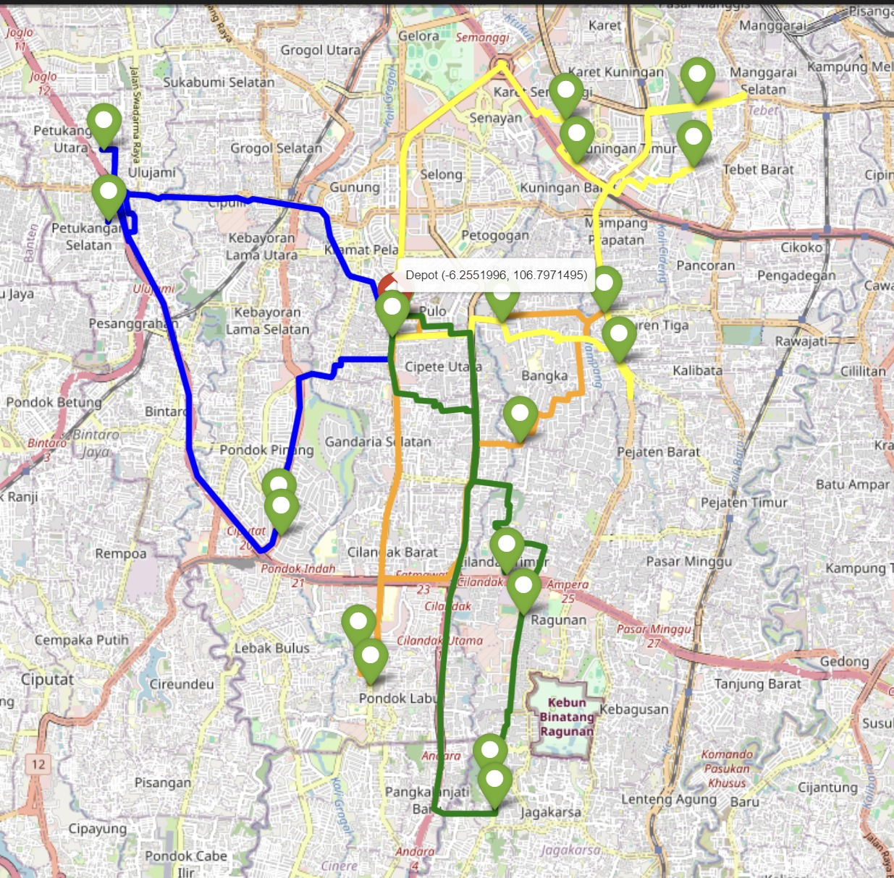

# Route Optimization Engine

Repositori ini menyelesaikan Vehicle Routing Problem menggunakan Openstreetmap dan library OR-Tools. VRP adalah masalah optimisasi klasik di mana sekelompok kendaraan diberi tugas untuk mengunjungi sejumlah lokasi untuk meminimalkan total jarak dan waktu yang ditempuh. Data yang digunakan adalah data alfamart dan indomaret se-Jakarta Selatan yang kemudian saya grouping hanya memuat 2 koordinat per kecamatan.


VRP adalah masalah optimasi klasik di mana sejumlah kendaraan bertugas untuk mengunjungi beberapa lokasi untuk meminimalkan total jarak yang dilalui.

- [Vehicle Routing Problem Solver with OpenStreetMap and OR-Tools](#route-optimization-engine)
  - [Approach of One-Step Optimization](#approach)
  - [Requirements](#requirements)
  - [Installation](#installation)
  - [Notebook demo](#notebook-demo)
    - [Features](#features)
    - [Example Data](#example-data)
    - [Notebook structure](#notebook-structure)
  - [Output](#output)
    - [Optimal Route for 20 Coordinates](#optimal-route-for-20-coordinates)
  - [Future Improvements and Extensions](#future-improvements-and-extensions)
  - [Resources and References](#resources-and-references)


## Approach

Vehicle Routing Problem (VRP) adalah salah satu bentuk permasalahan transportasi yang melibatkan pendistribusian barang maupun orang kepada pelanggan dengan menggunakan kendaraan dan bertujuan untuk meminimasi beberapa tujuan distribusi.

**Optimasi Pada 20 Koordinat:**
    - Pertama-tama, mengimpor library yang digunakan
    - Load input data
    - Pengelompokkan place_id, latitude dan longitude
    - Menginisasi center location dan kendaraan yang digunakan (Menggunakan 4 kendaraan)
    - Menginisiasi distance matrix dari library Openstreetmap (ox) dan nodes (titik pemberhentian) tiap kendaraan
    - Melakukan optimasi dan mendapatkan rute dari kendaraan 1 sampai kendaraan 4
    - Plot rute Openstreetmap yang menampilkan maps

## Requirements
* Python Notebook
* Conda
* Git (optional)

## Installation
Clone repository:
```bash
git clone <repository_url>
cd <repository_directory>
```
Membuat dan aktivasi Conda environment menggunakan file env.yaml:
```bash
conda env create -f env.yaml
conda activate travelling-salesman-routing
```

## Notebook demo

Repository ini menyediakan sebuah Jupyter notebook untuk demonstrasi step-by-step tentang bagaimana menyelesaikan VRP menggunakan OpenStreetMap dan library OR-Tools.
### Features

- **API_OSMR**: Modul Python untuk memanggil API OpenStreetMap dan mengambil matriks jarak antara lokasi-lokasi.
- **Routing**: Modul Python untuk mengoptimalkan rute menggunakan library OR-Tools dan memplot solusinya pada peta Folium.

### Example Data
Sampel input data (```data\input\Data_Alfamart Indomaret_South Jakarta.csv```) terdapat latitude dan longitude dari koordinat alfamart dan indomaret di Jakarta Selatan. Data tersebut dibaca dari file CSV dan digunakan untuk menghitung rute optimal.

### Notebook structure
Notebook ini terbagi menjadi beberapa tahap:
The notebook is divided into the following sections:

1. **Introduction to the Vehicle Routing Problem:**
    - Gambaran umum tentang VRP dan pentingnya dalam optimisasi dan logistik.
    - Penjelasan tentang pendekatan optimisasi dua langkah untuk perjalanan antar kota dan kunjungan titik penjualan di dalam kota.

2. **Data Loading and Preprocessing:**
    - Membaca dataset (`data\input\Data_Alfamart Indomaret_South Jakarta.csv`) yang berisi nilai latitude dan longitude dari titik penjualan di berbagai kota.
    - Mengelompokkan data untuk menghitung jarak dan memilih 20 titik koordinat tempat untuk tiap kecamatan.

3. **Visualization of Optimal Routes:**
    - Memplot rute optimal untuk mengunjungi semua outlet pada maps Folium.
    - Memplot rute optimal untuk mengunjungi titik penjualan outlet yang dipilih di setiap outlet pada maps Folium.

### Optimal Route for 20 Coordinates
Gambar peta di bawah ini memperlihatkan rute optimal untuk mengunjungi semua outlet Alfamart dan Indomaret. Ini menggambarkan urutan kota yang akan dikunjungi, dimulai dari kota awal yang dipilih dan melintasi semua kota lainnya, kembali ke titik awal, serta pada keempat kendaraan. Setiap kota direpresentasikan oleh penanda, dan garis penghubung menunjukkan jalur yang dioptimalkan antara kota-kota tersebut.




## Future Improvements and Extensions
Ada beberapa area di mana project dapat ditingkatkan untuk memenuhi kondisi real yang lebih kompleks. Beberapa progress ke depannya yaitu:

- **Fungsi def untuk code lebih sederhana**: Membuat dan merapikan api_osmr.py dan routing.py untuk code notebook (main.ipynb) lebih sederhana.

- **Time Windows for Visiting**: Memasukkan batasan waktu untuk mengunjungi titik penjualan, di mana setiap lokasi memiliki waktu buka dan tutup tertentu. Hal ini akan memastikan bahwa rute mengikuti jam operasional bisnis.

- **Interactive User Interface**: Memungkinkan pengguna untuk memasukkan dataset mereka sendiri, memvisualisasikan rute yang dioptimalkan, dan mengekspor hasilnya.

## Resources and References

- [Traveling Salesman Problem - Wikipedia](https://en.wikipedia.org/wiki/Travelling_salesman_problem).

- [Open Source Routing Machine (OSRM) API](https://project-osrm.org/).

- [Google OR-Tools](https://developers.google.com/optimization/routing/tsp?hl=es-419).

- [Folium Package](https://python-visualization.github.io/folium/).

